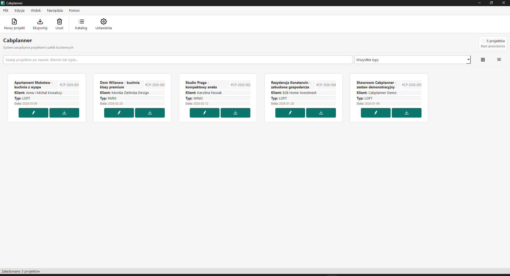
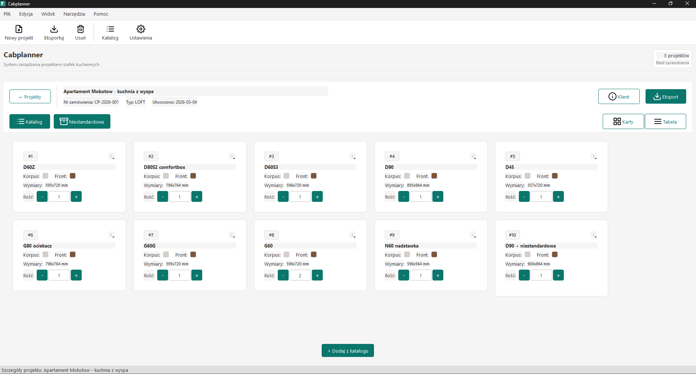
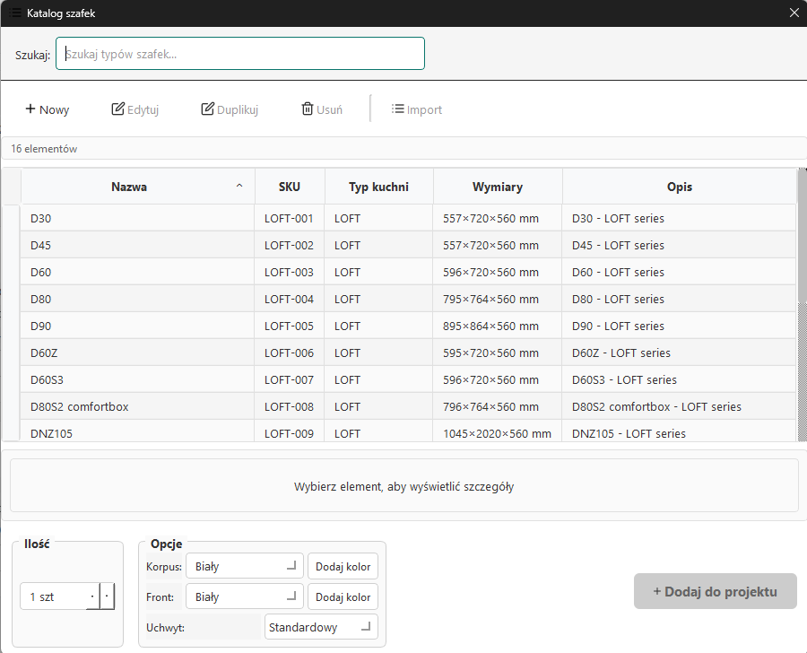
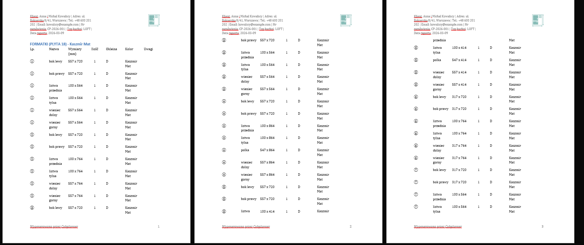
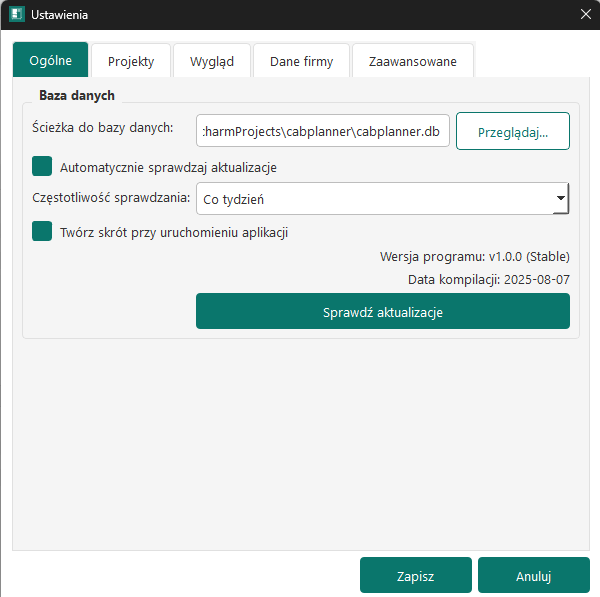

# Cabplanner

Cabplanner is a Windows desktop application for planning custom cabinet projects and generating production-ready Word reports for cabinetry workflows.

`PySide6` | `SQLAlchemy` | `Alembic` | `python-docx` | `SQLite` | `PyInstaller`

Closed-source portfolio project. This repository is presented as a showcase of product thinking, desktop engineering, and domain-specific workflow design.

*Main dashboard view showing the project overview and day-to-day workflow entry point.*

## What this project does

Cabplanner supports the full flow from project setup to export:

- manage cabinet projects and client-facing job data in a desktop UI
- work with a reusable cabinet catalog and add fully custom cabinet configurations
- calculate parts from formula-driven cabinet rules and stored constants
- generate `.docx` reports with parts, fronts, HDF, glass shelves, and accessories
- persist project data in SQLite and handle schema evolution with Alembic migrations
- check for packaged app updates and apply them in the installed Windows build

## What I built

I built this project as an end-to-end desktop product, not just a UI prototype.

- I designed the main desktop workflow around project management, cabinet planning, and report generation.
- I split business logic into service-layer modules so reporting, settings, catalog, formulas, and updates stay separate from the UI.
- I implemented local persistence with SQLite plus migration support for evolving schemas.
- I built a formula-based sizing system for custom cabinets so dimensions can be derived from cabinet names, constants, and user input.
- I added automated Word report generation with branding hooks and grouped production sections.
- I packaged the app for Windows distribution and added an update flow tied to GitHub releases.
- I covered the core workflows with a broad automated test suite.

## Feature Highlights

- Project dashboard with searchable project views and detailed project drill-down.
- Cabinet catalog flow for reusing seeded cabinet templates and materialized parts.
- Custom cabinet flow for ad hoc configurations that can coexist with catalog templates.
- Word report generator that aggregates project elements into structured `.docx` output.
- Settings and theme support, including report branding inputs and user preferences.
- Built-in update flow for packaged releases.
- Local-first data model backed by SQLite.

*Project details screen with cabinet-level workflow, quantities, and project-specific editing tools.*

*Cabinet catalog browsing experience showing reusable templates and selection flow.*

*Generated Word report with grouped production sections and branded document output.*

*Settings and update experience showing user preferences and packaged app maintenance.*

## Why it stands out technically

- The codebase separates UI modules from domain and service logic instead of keeping everything in window classes.
- Database changes are handled through Alembic migrations rather than manual schema resets.
- The app uses SQLite for local persistence and seeds cabinet templates and formula constants on first run.
- The packaged app includes a single-instance guard and a release updater built around GitHub-hosted releases.
- Reporting is a real output pipeline, not a mock export. The generator assembles project data into a structured Word document.
- The repository currently includes `37` test files and about `446` test cases covering services, UI flows, updater logic, migrations, formulas, and reporting.

## Architecture At A Glance

- Desktop UI: `PySide6`
- Persistence: `SQLite`, `SQLAlchemy`, `Alembic`
- Document output: `python-docx`
- Distribution: `PyInstaller`
- Core layers:
  - GUI modules for project, catalog, settings, and cabinet editing workflows
  - services for project operations, formulas, reports, settings, colors, catalog, and updates
  - schema and migration layers for persistent application data

## Code Quality

- Automated tests cover both isolated services and broader workflow regressions.
- Migration support is built into startup so the installed app can evolve without manual database rework.
- Edge cases are explicitly tested, including custom cabinets that share names with catalog templates.
- The project includes packaging and updater logic alongside the core product workflow, which reflects production-oriented engineering rather than a demo-only build.

## Access And Licensing

Cabplanner is not open source. The code is shared here as a portfolio artifact and engineering showcase.

You are welcome to review the repository structure, architecture, and implementation approach, but the code is not licensed for reuse, redistribution, or resale.

The screenshots used in this README live under `docs/readme/`.
